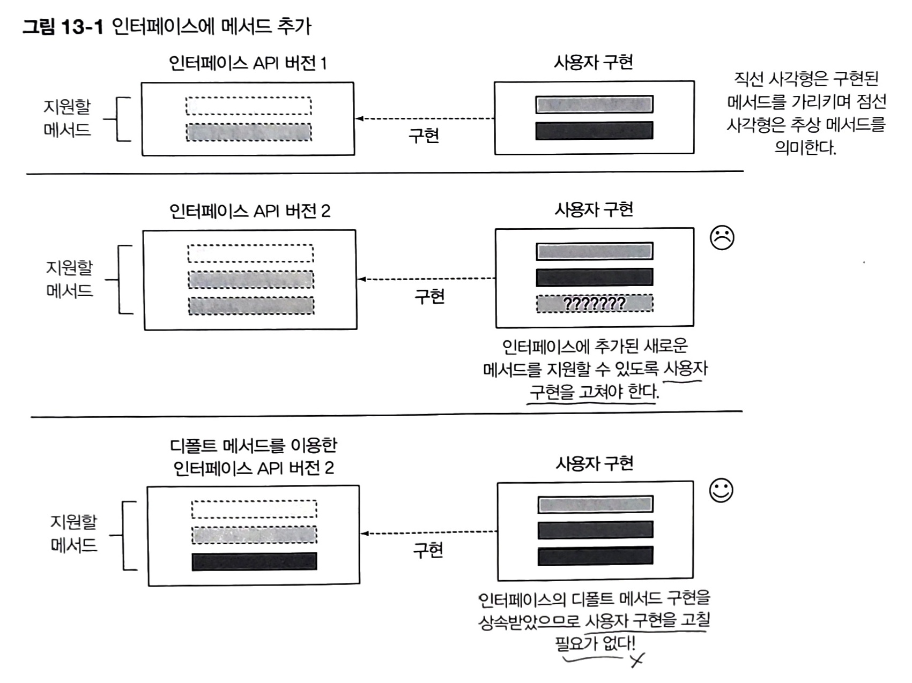
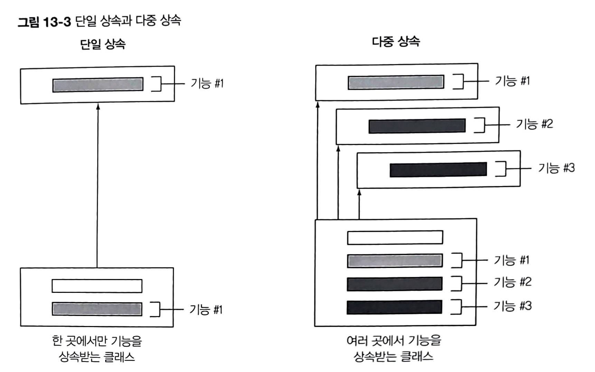
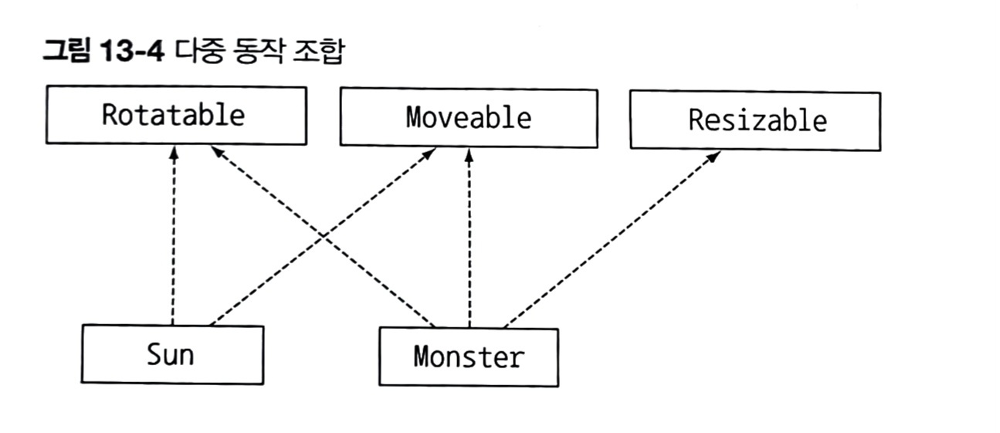
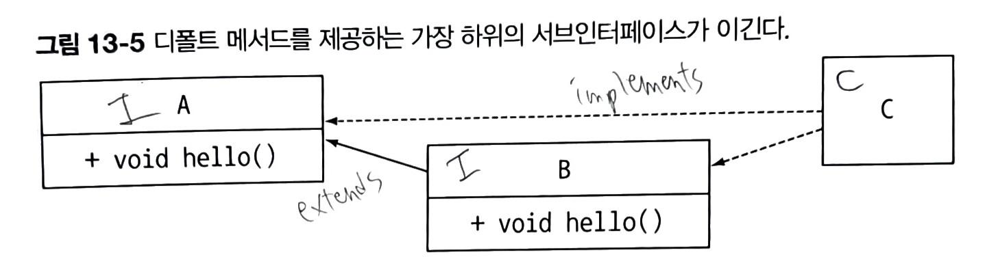
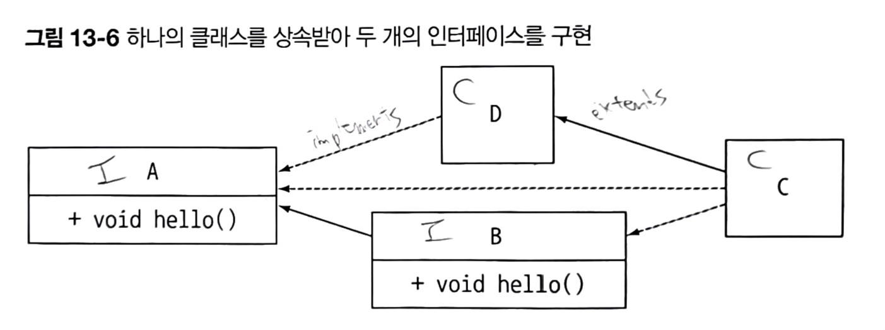
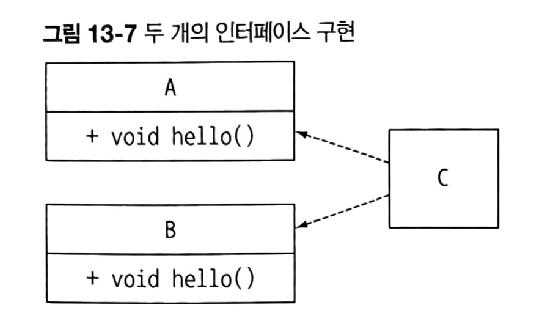

# 13.0 개요
## 문제 상황
- 라이브러리 설계자 입장에서 인터페이스를 바꾸고 싶을 때
- 바꾸면 이전에 구현했던 모든 클래스들의 구현도 고쳐야 한다.

## 해결 방법
1. 인터페이스 내부의 **정적 메서드**
1. 인터페이스 내부의 **디폴트 메서드**

- 예시
    ```java
    List<Integer> numbers = Arrays.asList(3, 5, 1, 2, 6);
    numbers.sort(Comparator.naturalOrder());
    ```
    - `sort(...)` : default 메서드
    - `Comparator.naturalOrder()` : 정적 메서드

    </br>


> [!NOTE]
> **정적 메서드와 인터페이스**
> 
> - 자바에서는 인터페이스, 인터페이스의 인스턴스를 활용할 수 있는 정적메서드들의 모음집인 "**유틸리티 클래스**"를 활용한다.
> - 자바 8에서는 인터페이스에 직접 정적 메서드를 구현할 수 있다.
> - 유틸리티 클래스가 없어져도 되지만, 이전 버전들과의 호환성을 위해 남아있다.

</br>

</img>
➡️ 기존의 코드 구현을 바꾸도록 강요하지 않으면서 인터페이스 바꿀 수 있음.


</br></br>


# 13.1 변화하는 API
## 13.1.0 API를 바꾸는 것이 왜 어려운가?
자바 그리기 라이브러리 설계자가 되었다고 가정
- Interface `Resizable` : `setHight`, `setWidth`, `getHeight`, `getWidth`, `setAbsoluteSize` 등을 정의하는 인터페이스 제공
- class `Rectangle`, `Square` : `Resizable`을 구현하는 클래스 제공
- class `Ellipse` : 사용자가 직접 `Resizable`을 구현하는 클래스

이때, `Resizable`에 `setRelativeSize`라는 메서드를 추가하고 싶다.


</br>

## 13.1.1 API 버전 1
- 초기 버전
    ```java
    public interface Resizable extends Drawable {
        int getWidth();
        int getHeight();
        void setWidth(int width);
        void setHeight(int height);
        void setAbsoluteSize(int width, int height);
    }
    ```
- 사용자 구현
    ```java
    public class Ellipse implements Resizable {
        ...
    }
    ```
    ```java
    public class Game {
        public static void main(String... args) {
            List<Resizable> resizableShapes = Arrays.asList(new Square(), new Rectangle(), new Ellipse()); //크기를 조절할 수 있는 모양 리스트
            Utils.paint(resizableShapes);
        }
    }

    public class Utils {
        public static void paint(List<Resizable> l) {
            l.forEach(r -> {
                r.setAbsoluteSize(42, 42);
                r.draw();
            })
        }
    }
    ```


</br>

## 13.1.2 API 버전 2
- 시간이 지나고 `Resizable`에 `setRelativeSize` 메서드 추가
  
    ```java
    public interface Resizable extends Drawable {
        int getWidth();
        int getHeight();
        void setWidth(int width);
        void setHeight(int height);
        void setAbsoluteSize(int width, int height);
        void setRelativeSize(int wFactor, int hFactor); //추가된 메서드
    }
    ```
</br>

## 13.1.3 사용자가 겪는 문제
1. `Resizable`을 구현하는 모든 클래스는 `setRelativeSize` 메서드를 구현해야 한다. 하지만 `Ellipse`는 `setRelativeSize` 를 구현하지 않는다.
    - 인터페이스에 새로운 메서드를 추가하면 **바이너리 호환성**은 유지된다.
      
        > **바이너리 호환성** : 새로 추가된 메서드를 **호출하지만 않으면**, 새로운 **메서드 구현이 없어도** 기존 클래스 파일 구현이 잘 **동작**한다.
    - 하지만, 언젠가는 setRelativeSize를 사용하는 코드로 바꿀 수 있다.
1. 공개된 API를 고치면 **기존 버전과의 호환성 문제** 발생
    - 자신만의 API를 별도로 만든 다음 예전 버전과 새로운 버전을 직접 관리하면 되긴 함. 그러나
        1. 라이브러리 관리가 복잡합
        1. 사용자는 같은 코드에 두 버전 모두 사용해야 하는 상황 발생
        1. 결국 메모리 사용⬆️, 로딩 시간⬆️

</br>

> [!NOTE]
> **바이너리 호환성, 소스 호환성, 동작 호환성**
> 
> - **바이너리 호환성** : 뭔가를 바꾼 이후에도 **에러 없이** 기존 **바이너리가 실행**될 수 있는 상황.
>   - 인터페이스에 메서드를 추가했을 떄, 추가된 메서드를 호출하지 않는 한 문제 X
> - **소스 호환성** : 코드를 고쳐도 **기존 프로그램**을 **성공**적으로 **재컴파일**
>   - 인터페이스에 메서드 추가 ➡️ 소스 호환성 X. 추가한 메서드를 구현하도록 클래스를 고쳐야 하기 때문.
> - **동작 호환성** : 코드를 바꾼 다음에도 **같은 입력값**이 주어지면 프로그램이 **같은 동작**을 실행
>   - 인터페이스에 메서드를 추가해도 프로그램에서 추가된 메서드를 호출할 일은 없으므로 동작 호환성 O.

</br></br>

# 13.2 디폴트 메서드란 무엇인가?
> **디폴트 메서드** : 인터페이스 자체에서 기본으로 제공하는 구현된 메서드

</br>

## 구조
- 특징
    1. `default` 키워드
    1. 메서드 **바디** 포함

- 예시
    ```java
    public interface Sized {
        //추상메서드
        int size();

        //디폴트 메서드
        default boolean isEmpty() {
            return size() == 0;
        }
    }
    ```

> [!NOTE]
> **추상 클래스와 자바 8의 인터페이스**
> - 공통점 : **추상 메서드**와 **바디**를 포함하는 메서드 정의 가능
> - 차이점 
>   | 추상 클래스 | 인터페이스 |
>   | --- | --- |
>   | 하나의 추상 클래스만 상속(**단일 상속**) | 여러 개의 인터페이스 구현(**다중 구현**) |
>   | **인스턴스 변수**(필드)로 공통 상태 가질 수 **O** | 인스턴스 변수 가질 수 **X** |

</br>
</br>

# 13.3 디폴트 메서드 활용 패턴
## 13.3.1 선택형 메서드
1. 잘 사용하지 않는 메서드
    - ex) `Iterator`의 `remove()`

    ⬇️
1. 기존의 **빈 구현** 
    ```java
    interface Iterator<T> {
        boolean hasNext();
        T next();
        void remove();
    }
    ```
    ```java
    class IteratorImpl<...> implements Iterator<...> {
        ...
        ...
        void remove() {} //빈 구현
    }
    ```

    ⬇️
1. 디폴트 메서드의 **기본 구현** 
    ```java
    interface Iterator<T> {
        boolean hasNext();
        T next();

        //잘 사용하지 않던 remove 함수의 기본 구현 제공
        default void remove() {
            throw new UnsupportedOperationException();
        }
    }
    ```

    ⬇️
1. 빈 구현 할 필요 X, **불필요한 코드 줄임**

</br>

## 13.3.2 동작 다중 상속
</img>

### 예시
```java
public class ArrayList<E> extends AbstractList<E> //한 개의 클래스 상속
    implements List<E>, RandomAccess, Cloneable, Serializable { //4개의 인터페이스 구현
}
```
- ArrayList는 AbstractList, List, RandomAccess, Cloneable, Serializable의 **`서브형식(subtype)`** 이다.


### 장점
1. **중복되지 않는 최소한의 인터페이스**를 유지 ➡️ 동작을 **쉽게 재사용**&**조합**

    - **중복되지 않는 최소한의 인터페이스**의 예시
        ```java
        public interface Rotatable {
            void setRotationAngle(int angleInDegrees); //구현 필요
            int getRotationAngle(); //구현 필요

            //기본 구현이 제공되는 default method. 따로 구현 X.
            default void rotateBy(int angleInDegrees) {
                setRotationAngle((getRotationAngle() + angleInDegrees) % 360);
            }
        }
        ```
        ```java
        public interface Moveable {
            int getX();
            int getY();
            void setX(int x);
            void setY(int y);

            default void moveHorizontally(int distance) {
                setX(getX() + distance);
            }

            default void moveVertically(int distance) {
                setY(getY() + distance);
            }
        }
        ```
        ```java
        public interface Resizable {
            int getWidth();
            int getHeight();
            void setWidth(int width);
            void setHeight(int height);
            void setAbsoluteSize(int width, int height);

            default void setRelativeSize(int wFactor, int hFactor) {
                setAbsoluteSize(getWidth() / wFactor, getHeight() / hFactor);
            }
        }
        ```
    - **인터페이스 조합** 예시
        ```java
        public class Monster implements Rotatable, Moveable, Resizable {
            //모든 추상 메서드 구현 O.
            //디폴트 메서드(rotateBy, moveHorizontally, moveVertixally, setRelativeSize) 구현 X.
        }
        ```
        ```java
        public class Sun implements Moveable, Rotatable {
            //모든 추상 메서드 구현 O.
            //디폴트 메서드(rotateBy, moveHorizontally, moveVertixally) 구현 X.
        }
        ```
        </img>
1. 상위 인터페이스의 디폴트 메서드의 구현을 고쳐야 할 때, 구현하는 모든 클래스들은 **자동**으로 **변경된 코드**를 상속받는다.

</br>

> [!WARNING] 
>
> **옳지 못한 상속** 
> 
> 한 개의 메서드를 재사용하려고 100개의 메서드, 필드가 정의되어 있는 클래스를 상속받는 것은 좋지 X.
> 
> 이럴 때는 **멤버 변수**를 이용해 클래스에서 필요한 메서드를 **직접 호출**하는 **`"델리게이션"`** 을 사용하는 것이 좋다.

</br></br>

# 13.4 해석 규칙
클래스는 여러 인터페이스의 다중 구현이 가능하다. </br>
그런데 이때, **같은 시그니처**를 갖는 **디폴트 메서드**를 **여러 인터페이스, 클래스에서 상속**받는 상황이 생길 수 있다.

```java
public interface A {
    default void hello() {
        System.out.println("Hello from A");
    }
}

public interface B extends A {
    default void hello() {
        System.out.println("Hello from B");
    }
}

public class C implements B, A {
    public static void main(String... args) {
        new C().hello(); //무엇이 출력될까?
    }
}
```

그럼 어떤 인터페이스의 디폴트 메서드를 사용하게 될까?


## 규칙
1. **클래스**가 항상 이긴다. 
    - 우선권 : 클래스/슈퍼클래스에서 정의한 메서드 > 디폴트 메서드
    - 예시
        1. 클래스 D 추가
            ```java
            public class D implements A { 
                void hello() {
                    System.out.println("Hello from D");
                }
            }

            public class C extends D implements B, A {
                public static main(String... args) {
                    new C().hello(); //무엇이 출력될까?
                }
            }
            ```
            - D는 디폴트 메서드인 `hello()`를 오버라이드 O. <br>
                ⬇️ <br>
              _"클래스의 메서드 구현"_ 규칙 O.
            - 우선권 : D > B
            - `"Hello from D"` 출력 
1. 1번 규칙 이외의 상황에서는 **서브인터페이스**가 이긴다.
    - 예시
        1. 위 예제
            </img>
            - B가 A를 상속받는 서브인터페이스 ➡️ 우선권 : B > A
            - `"Hello from B"` 출력
        1. 클래스 D 추가
            </img>
            ```java
            public class D implements A { }

            public class C extends D implements B, A {
                public static main(String... args) {
                    new C().hello(); //무엇이 출력될까?
                }
            }
            ```
            - D는 디폴트 메서드인 `hello()`를 오버라이드 X. <br>
                ⬇️ <br>
             A의 디폴트 메서드 구현을 상속받는다. <br>
             ⬇️ <br>
              _"1. 클래스의 메서드 구현"_ 이 아니므로 1번 규칙 X.
            - B가 A를 상속받는 서브인터페이스 ➡️ 우선권 : B > A
            - `"Hello from B"` 출력
1. 1, 2로도 우선순위가 결정되지 않았다면, **명시적**으로 디폴트 메서드를 **오버라이드**하고 **호출**해야 한다.
    - 예시
        1. B가 A를 상속받지 않을 때
            </img>
            ```java
            public interface A {
                void hello() {
                    System.out.println("Hello from A");
                }
            }

            public interface B {
                void hello() {
                    System.out.println("Hello from B");
                }
            }

            public class C implements B, A { }
            ```

            - 인터페이스 간에 상속관계 X ➡️ _"2. 서브인터페이스"_ 규칙 X.
            - `"Error: class C inherits unrelated defaults for hello() from types B and A"` 출력

    - 해결
        - 사용하려는 메서드를 **명시적**으로 **선택**
            ```java
            public class C implements B, A {
                void hello() {
                    B.super.hello();
                }
            }
            ```
            > `X.super.m(...)`
            >    - `X` : 호출하려는 메서드 `m`의 슈퍼인터페이스
            >    - `m(...)` : 호출하려는 메서드

