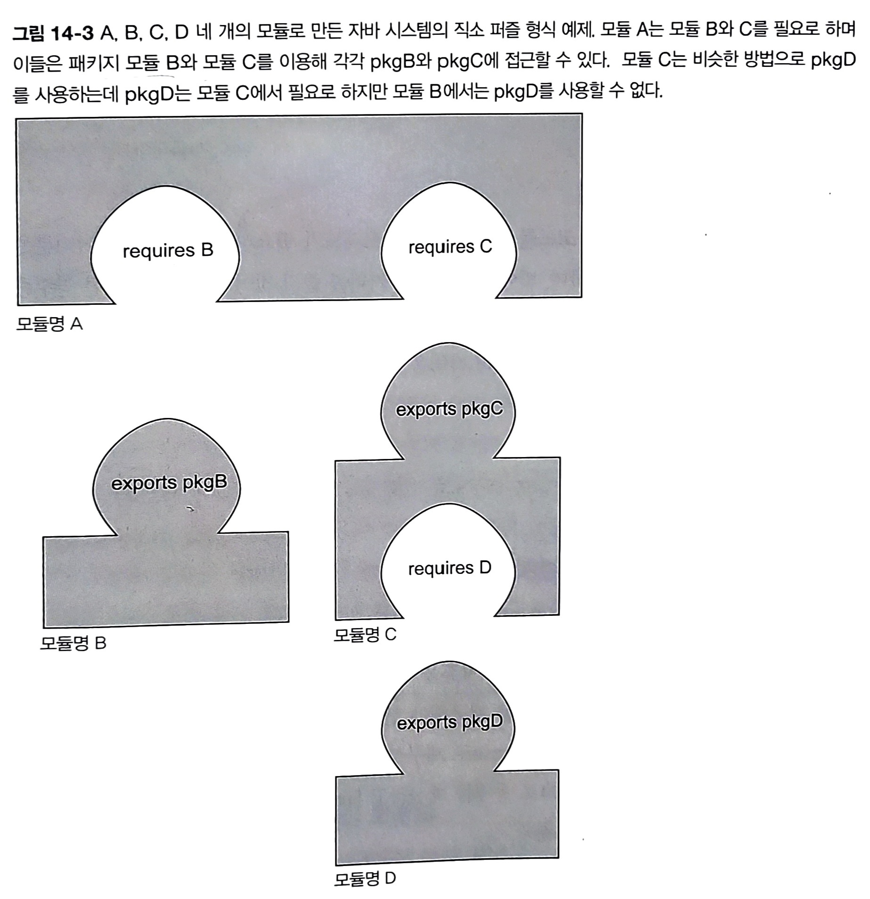

# 14.1 모듈화: 추론하기 쉬운 소프트웨어
지금까지는 이해하고, 유지보수하기 쉬운 코드를 구현하는 데 사용할 수 있는 새로운 언어기능을 공부했음 👉 `"저수준"`

궁극적으로 소프트웨어 아키텍처에서 기반 코드를 바꿔야 할 때, 유추하기 쉽도록 생산성을 높일 수 있는 프로젝트가 필요함. 👉 `"고수준"`

추론하기 쉬운 소프트웨어를 만드는 데에는 **"관심사 분리"**, **"정보 은닉"** 이 필요하다.

</br>

## 14.1.1 관심사분리
> **관심사분리** (SoC, Separation of Concerns) : 컴퓨터 프로그램을 고유의 기능으로 나누는 동작을 권장하는 원칙.

- 특징
    - 회계 애플리케이션 개발을 한다고 가정하면, </br>
    파싱, 분석, 레포트 기능을 **모듈**, 즉 **서로 거의 겹치지 않는 코드 그룹**으로 분리할 수 있다.

    - 자바 패키지가 클래스를 그룹으로 만든다고 생각할 수 있지만, </br>
    패키지는 모듈성을 지원하지 않는다.

    - M/V/C 같은 아키텍처 관점에서의 상황, 복구 기법(ex. 장애 감지, 재시도)과 비즈니스 로직을 분리하는 하위 수준 접근 등의 상황에 유용

- 장점
    1. 개별 기능을 **따로 작업**할 수 있음 ➡️ 쉬운 협업
    1. 개별 부분을 **재사용**하기 쉬움
    1. 전체 시스템을 **쉽게 유지보수** 가능함.


</br></br>

## 14.1.2 정보 은닉
> **정보 은닉** : 세부 구현을 숨기도록 장려하는 원칙

- 특징
    - 요구사항이 자주 바뀌는 상황에서 세부 구현을 숨김으로써 어떤 부분을 수정했을 때 다른 부분까지 영향을 미칠 가능성 줄어듦
    - 즉, **코드**를 **관리**하고 **보호**하는 데 유용한 원칙
    
- **컴파일러**로 은닉성 확인하기    
    - `클래스 내의 컴포넌트` : **`private`** 키워드를 사용했는지를 기준으로 컴파일러을 이용해 캡슐화를 확인할 수 있었다.
        > **캡슐화** : 특정 코드 조각이 애플리케이션의 다른 부분과 고립되어 있음
    - `클래스`, `패키지` : 자바 9 이전에는 의도된 대로 공개되었는지 컴파일러로 확인할 수 **없었다**.


</br></br>

# 14.2 자바 모듈 시스템을 설계한 이유
## 14.2.1 모듈화의 한계
- 자바는 `클래스`, `패키지`, `JAR` 세 가지 수준의 **코드 그룹화** 제공
    - `클래스` : 접근 제한자, 캡슐화
    - `패키지`, `JAR` : 캡슐화 거의 지원 X

### 1) 제한된 가시성 제어
1. 패키지 간의 가시성 제어 기능 거의 X </br> 
    > **가시성 제어** : public, protected, default(패키지 수준), private

    ⬇️ </br>
1. 한 패키지의 클래스&인터페이스를 다른 패키지로 공개하려면 public으로 선언해야 함 </br>
    ⬇️ </br>
1. 모두에게 공개하는 꼴 </br>
    ⬇️ </br>
1. `public`이므로 사용자가 내부 구현을 마음대로 사용 </br>
    ⬇️ </br>
1. 내부적으로 사용할 목적이었는데 다른 프로그래머가 써버리면, 라이브러리 코드 바꾸기가 어려워짐. 보안 측면에서도 위험함. </br>


### 2) 클래스 경로
애플리케이션을 번들&실행할 때, 

1. 클래스를 모두 컴파일 
1. 한 개의 평범한 JAR 파일에 넣음 
1. 클래스 경로에 이 JAR 파일을 추가해 사용 

그러나, 위와 같은 `클래스 경로 + JAR` 조합은 약점이 있음

1. 클래스 경로에는 같은 **클래스를 구분**하는 **버전** 개념이 **없다**.
    - 파싱 라이브러리의 `JSONParser` 클래스를 버전 1.0인지 2.0인지 지정 못함
    - 클래스 경로에 두 가지 버전의 같은 라이브러리 존재
    - 이때 어떤 일이 일어날지 예측 X.
1. 클래스 경로에는 **명시적인 의존성**을 **지원하지 않는다**.
    - 한 JAR 안의 모든 클래스는 `classes`라는 한 주머니로 합쳐짐
    - 한 JAR가 다른 JAR에 포함된 클래스 집합을 사용하라고 **명시적으로 의존성을 정의할 수 없음** 👉 `"JAR 지옥"` or "`클래스 경로 지옥"`
    - 어떤 일이 일어날지 예측 X. 
    - "빠진 게 있는가?", "충돌이 있는가?" 같은 의문 발생
    - 결국 에러를 발생시키지 않고 **정상적으로 실행할 때까지** 클래스 경로에 클래스 파일을 더하거나, 제거해보는 수밖에 없음.
</br></br>

## 14.2.2 거대한 JDK
1. 환경에 따라 JDK 전부를 필요로 하지 않는 문제 발생
1. 컴팩트 프로파일 등장
    > **컴팩트 프로파일** : 관련 분야에 따라 JDK 라이브러리가 세 가지 프로파일로 나뉘어 각각 다른 메모리 풋프린트를 제공

1. 그러나, 땜질식 처리였고, 내부 API가 외부에 공개됨. 
1. 호환성을 깨지 않고는 관련 API를 바꾸기가 어려워짐
1. JDK 자체를 모듈화할 수 있는 자바 모듈 시스템의 필요성 제기됨.

</br>

## 14.2.3 OSGI와 비교
> [!NOTE]
> 스킵 가능!

- **OSGi란**
    - 자바 9에서 모듈화 기능이 추가되기 전에도 OSGi라는 모듈 시스템이 존재했음. (공식 기능 X)
    - OSGi는 광범위한 영역, 직소에서 제공하지 않는 여러 기능 제공
    - 번들이라 불리는 OSGi 모듈을 특정 OSGi 프레임워크 내에서만 실행
        - 프레임워크 예시) 아파치 펠릭스, 에퀴녹스
    - 번들의 동작에 필요한 **외부 패키지**가 **무엇**이며, 어떤 **내부 패키지**가 외부로 노출되어 다른 번들로 **제공**되는지를 서술하는 **텍스트 파일**로 각 번들을 정의.
    

- **장점**
    1. **시스템을 재시작하지 않고도** 애플리케이션의 다른 하위 부분을 **핫스왑**할 수 있다.
       
        > **핫스왑** : 시스템을 재시작하지 않고 코드나 모듈을 변경하는 기술
    1. 프레임워크 내에 **같은 번들의 다른 버전**을 설치할 수 있다

- **자바 9 모듈 시스템과의 차이점**
    - `OSGi` : 각 번들이 자체적인 클래스 로더 가짐. 
    - `자바 9 모듈 시스템의 직소` : 애플리케이션 당 한 개의 클래스를 사용하므로 버전 제어 X

</br></br>

# 14.3 자바 모듈 : 큰 그림
### 1) 모듈의 구조
```java
module 모듈명 { 
    바디
}
```
> [!NOTE]
> `module`, `requires`, `export` 같은 모듈 관련 용어는 `제한된 키워드`다. 
>
> 프로그램 내에서는 자유롭게 사용할 수 있지만, 모듈이 허용된 곳에서는 키워드로 해석됨

### 2) 모듈 디스크립터
- **`module-info.java`** 라는 파일에 저장됨
    - 엄밀하게 따지면 
        - **`모듈 선언(module declareation)`** : **텍스트 형식**
        - **`모듈 디스크립터`** : `module-info.class`에 저장된 **바이너리 형식**
- 보통 **패키지와 같은 폴더**에 위치
- 한 개 이상의 패키지를 서술&캡슐화하고, 단순한 상황에서는 이들 패키지 중 한 개만 외부로 노출시킴
```java
//module-info.java
module 모듈명 { 
    exports 패키지명 //한 페이지를 노출시키는 간단한 형식
    requires 모듈명 //0개 이상의 모듈
}
```

</img>
- `exports` : 돌출부
- `requires` : 패인 부분

</br></br>

# 14.4 자바 모듈 시스템으로 애플리케이션 개발하기
## 14.4.1 애플리케이션 셋업
```
- 파일이나 URL에서 비용 목록을 읽는다.
- 비용의 문자열 표현을 파싱한다.
- 통계를 계산한다.
- 유용한 요약 정보를 표시한다.
- 각 태스크의 시작, 마무리 지점을 제공한다.
```
➡️ 이 요구사항들에서 분리할 수 있는 여러 기능 (관심사)

1. 다양한 소스에서 데이터를 읽음(Reader, HttpReader, FileReader)
1. 다양한 포맷으로 구성된 데이터를 파싱(Parser, JSONParserk ExpenseJSON-Parser)
1. 도메인 객체를 구체화(Expense)
1. 통계를 계산하고 반환(SummaryCalculator, SummaryStatistics)
1. 다양한 기능을 분리 조정(ExpensesApplication)

➡️ 이 기능들을 그룹화
- expenses.readers
- expenses.readershttp
- expenses.readersfile
- expenses.parsers
- expenses.parsersjson
- expenses.model
- expenses.statistics
- expenses.application

</br>

## 14.4.2 세부적인 모듈화, 거친 모듈화
| | 세부적인 모듈화 | 거친 모듈화 |
| --- | --- | --- |
| **특징** | 모든 패키지가 자신의 모듈을 갖는다. | 한 모듈이 시스템의 모든 패키지를 포함한다. |
| **단점** | 이득에 비해 설계 비용이 증가 | 모듈화의 장점을 잃음 | 

</br>

## 14.4.3 자바 모듈 시스템 기초
### 1) 디렉터리 구조
```
|-- expenses.application
  |-- module-info.java    ===========> 모듈 디스크립터
  |-- com
    |-- example
      |-- expenses
        |-- application
          |-- ExpensesApplication.java
```

### 2) 모듈 디스크립터
- `module-info.java`
- 모듈의 소스 코드 파일 **루트**에 위치
- 모듈의 **의존성**, **어떤 기능**을 외부로 **노출할지** 정의
- 현재는 이름만 정의되어 있고 내용은 비어있다.
    ```java
    module expenses.application {

    }
    ```

### 3) 모듈화 애플리케이션 실행


</br></br>


# 14.5 여러 모듈 활용하기
## 14.5.1 `exports` 구문
> `exports` : 다른 모듈에서 사용할 수 있도록 특정 패키지를 공개 형식으로 만든다.

### 1) 특징
- 모듈 내의 모든 것은 캡슐화되는데, **화이트 리스트** 기법을 이용하기 때문에 **다른 모듈에서 사용할 수 있는 기능이 무엇**인지 **명시적**으로 결정해야 한다.

### 2) 예시
```java
module expenses.readers {
    exports com.example.expenses.readers;
    exports com.example.expenses.readers.file;
    exports com.example.expenses.readers.http;
}
```
- 세 개 모두 모듈명이 아닌 **패키지명**이다.

### 3) 디렉터리 구조
```
|-- expenses.application
  |-- module-info.java    ===========> 모듈 디스크립터
  |-- com
    |-- example
      |-- expenses
        |-- application
          |-- ExpensesApplication.java


|-- expenses.readers      ===========> 모듈
  |-- module-info.java    ===========> 모듈 디스크립터
  |-- com                 ===========> 패키지
    |-- example
      |-- expenses
        |-- readers
          |-- Reader.java
        |-- file
          |-- FileReader.java
        |-- http
          |-- HttpReader.java
```

</br>

## 14.5.2 `requires` 구문
> `requires` : 의존하고 있는 모듈을 지정한다.

### 1) 예시
```java
module expenses.readers {
    requires java.base;

    exports com.example.expenses.readers;
    exports com.example.expenses.readers.file;
    exports com.example.expenses.readers.http;
}
```
- `requires` 다음 : 패키지 명이 아니라 **모듈명**이다.
- `exports` 다음 : 세 개 모두 모듈명이 아닌 **패키지명**이다.

</br>

> [!NOTE]
> 모든 모듈은 `java.base`라는 플랫폼 모듈에 의존하는데 항상 필요한 기본 모듈이므로 생략

</br></br>

## 14.5.3 이름 규칙
1. **인터넷 도메인명의 역순** (com.iteratrlearning.training)
1. **노출된 주요 API 패키지**와 **이름이 같아**야 한다.

</br></br>

# 14.6 컴파일과 패키징
1. 각 모듈에 `pom.xml`을 추가한다.
    ```
    |-- pom.xml **
    |-- expenses.application
      |-- pom.xml **
      |-- src
        |-- main
          |-- java
            |-- module-info.java **
            |-- com
              |-- example
                |-- expenses
                  |-- application
                    |-- ExpensesApplication.java

    |-- expenses.readers  
      |-- pom.xml **
        |-- src
          |-- main
            |-- java   
              |-- module-info.java **
              |-- com                 
                |-- example
                  |-- expenses
                    |-- readers
                      |-- Reader.java
                    |-- file
                      |-- FileReader.java
                    |-- http
                      |-- HttpReader.java
    ```
    - 전체 프로젝트의 빌드를 조정하기 위해 **모든 모듈의 부모 모듈**에도 `pom.xml` 추가
    - 모듈 디스크립터(module-info.java)는 `src/main/java` 디렉터리에 위치해야 함
    - 각 모듈은 독립적으로 컴파일됨 ➡️ 각각이 한 개의 프로젝트다.

1. `expenses.readers` 프로젝트의 `pom.xml`
    ```xml
    <?xml version="1.0" encoding="UTF-8"?>
    <project xmlns="http://maven.apache.org/POM/4.0.0" xmlns:xsi="http://www.w3.org/2001/XMLSchema-instance"
    xsi:schemalocation="http://maven.apache.org/POM/4.0.0 http://maven.apache.org/xsd/maven-4.0.0.xsd">
        <modelVersion>4.0.0</modelVersion>

        <groupId>com.example</groupId>
        <artifactId>expenses.readers</artifactId>
        <version>1.0</version>
        <packaging>jar</packaging>

        <parent>
            <groupId>com.example</groupId>
            <artifactId>expenses</artifactId>
            <version>1.0</version>
        </parent>
    </project>
    ```
    - 명시적으로 부모 모듈을 지정함

1. `expenses.application` 모듈의 `pom.xml`
    ```xml
    <?xml version="1.0" encoding="UTF-8"?>
    <project xmlns="http://maven.apache.org/POM/4.0.0" xmlns:xsi="http://www.w3.org/2001/XMLSchema-instance" xsi:schemaLocation="http://maven.apache.org/POM/4.0.0 http://maven.apache.org/xsd/maven-4.0.0.xsd">
        <modelVersion>4.0.0</modelVersion>

        <groupId>com.example</groupId>
        <artifactId>expenses.application</artifactId>
        <version>1.0</version>
        <packaging>jar</packaging>

        <parent>
            <groupId>com.example</groupId>
            <artifactId>expenses</artifactId>
            <version>1.0</version>
        </parent>

        <dependencies>
            <dependency>
                <groupId>com.example</groupId>
                <artifactId>expenses.readers</artifactId>
                <version>1.0</version>
            </dependency>
        </dependencies>
    </project>
    ```

    - `ExpenseApplication`이 필요로 하는 클래스와 인터페이스가 있으므로 `expenses.readers`를 의존성으로 추가

1. 전역 `pom.xml`
    ```xml
    <?xml version="1.0" encoding="UTF-8"?>
    <project xmlns="http://maven.apache.org/POM/4.0.0"
    xmlns:xsi="http://www.w3.org/2001/XMLSchema-instance"
    xsi:schemalocation="http://maven.apache.org/POM/4.0.0
    http://maven.apache.org/xsd/maven-4.0.0.xsd">
        <modelVersion>4.0.0</modelVersion>

        <groupld>com.examples</groupld>
        <artifactId>expenses</artifactId>
        <packaging>pom</packaging>
        <version>1.0</version>

        <modules>
            <module>expenses.application</module>
            <module>expenses.readers</module>
        </modules>

        <build>
            <pluginManagement>
                <plugins>
                <plugin>
                    <groupId>org.apache.maven.plugins</groupId>
                    <artifactId>maven-compiler-plugin</artifactId>
                    <version>3.7.0</version>
                    <configuration>
                        <source>9</source>
                        <target>9</target>
                    </configuration>
                </plugin>
                </plugins>
            </pluginManagement>
        </build>
    </project>
    ```

1. `mvn clean package`로 프로젝트 모듈➡️JAR 로 변환
1. 부산물(artifact) 생성
    - `./expenses.application/target/expenses.application-1.0.jar`
    - `./expenses.readers/target/expenses.readers-1.0.jar`

1. 애플리케이션 실행
    ```bash
    java --module-path \ 
    ./expenses.application/target/expenses.application-1.0.jar:\
    ./expenses.readers/target/expenses.readers-1.0.jar \
    --module \
    expenses.application/com.example.expenses.application.ExpensesApplication
    ```

</br></br>

# 14.7 자동 모듈
- 자바는 JAR를 자동 모듈이라는 형태로 적절하게 변환한다.
- **모듈 경로상**에 있으나 **`module-info` 파일**을 **가지지 않은** 모든 **JAR**는 **자동 모듈**이 된다.
- 자동 모듈은 자신의 **모든 패키지를 노출**시킨다.
- 자동 모듈의 이름은 **JAR 이름**을 이용해 정해진다.
    - 바꾸려면
        ```bash
        jar --file=./expenses. readers/target/dependency/httpclient-4.5.3.jar \
        --describe-module httpclient@4.5.3 automatic
        ```
    - httpclient라는 이름으로 바뀜.
    - httpclient JAR를 모듈 경로에 추가한 다음 애플리케이션 실행
        ```bash
        java --module-path \
        ./expenses. application/target/expenses .application-1.0.jar:\
        ./expenses . readers/ target/expenses.readers-1.0.jar \
        ./expenses. readers/ target/dependency/httpclient-4.5.3.jar \
        -module \
        expenses.application/com.example.expenses.application.ExpensesApplication
        ```

</br></br>

# 14.8 모듈 정의와 구문들
## 14.8.1  `requires`
생략
## 14.8.2  `exports`
생략
## 14.8.3 `requires transitive`
> `requires transitive` : 다른 모듈이 제공하는 public type을 한 모듈에서 사용할 수 있다고 지정할 수 있다. (**전이성**)

### 예시
```java
module com.iteratrlearning.ui {
    requires transitive com.iteratrlearning.core;

    exports com.iteratrlearning.ui.panels;
    exports com.iteratrlearning.ui.widgets;
}
```
```java
module com.iteratrlearning.application {
    requires com.iteratrlearning.ui;
}
```
- `com.iteratrlearning.application` 모듈은 `com.iteratrlearning.core`에서 노출한 public type에 접근할 수 O.
- 필요로 하는 모듈 (`com.iteratrlearning.ui`)이 다른 모듈(`com.iteratrlearning.core`)의 형식을 반환하는 상황에서 전이성 선언이 유용해짐.
- 즉, `com.iteratrlearning.core` ➡️ `com.iteratrlearning.ui` ➡️ `com.iteratrlearning.application`

</br>

## 14.8.4 `exports to`
> `exports to` : 사용자에게 공개할 기능을 제한함으로 가시성을 정교하게 제어

### 예시
```java
module com.iteratrlearning.ui {
    requires com.iteratrlearning.core;

    exports com.iteratrlearning.ui.panels;
    exports com.iteratrlearning.ui.widgets to com.iteratrlearning.ui.widgetuser;
}
```

- `com.iteratrlearning.ui.widgets`의 접근 권한을 가진 사용자의 권한을 `com.iteratrlearning.ui.widgetuser`로 제한할 수 있다.

</br>

## 14.8.5 `open`과 `opens`
> `open` : 모듈 선언에 open 한정자를 이용하면 다른 모듈에  모든 패키지를 Reflection access 할 수 있도록 허용할 수 있다.

> `Reflection(리플렉션)` : 실행 중인 클래스, 메서드, 필드 등에 접근하는 기능

### 1) 예시
1. `open` 없이 Reflection 접근 시 오류 발생
    1. 모듈 선언 (module-info.java)
        ```java
        module com.example {
            exports com.example;
        }
        ```
    1. Reflection을 사용해 필드 접근
        ```java
        package com.example;
        import java.lang.reflect.Field;

        public class ReflectionExample {
            private String secret = "Hidden Data";

            public static void main(String[] args) throws Exception {
                ReflectionExample obj = new ReflectionExample();
                Field field = ReflectionExample.class.getDeclaredField("secret");
                field.setAccessible(true); // private 필드 접근 시도
                System.out.println("Secret Value: " + field.get(obj));
            }
        }
        ```
    1. 실행하면 에러 발생 (Java 9 이상)
        ```java
        java.lang.reflect.InaccessibleObjectException:
        Unable to make field private java.lang.String com.example.ReflectionExample.secret accessible
        ```
1. `open` 키워드 사용하여 Reflection 허용
    1. open 사용한 모듈 선언
        ```java
        open module com.example {
            exports com.example;
        }
        ```
    1. 실행 결과
        ```java
        Secret Value: Hidden Data
        ```

</br>

### 2) 특징
- 자바 9 이전에는 리플렉션으로 객체의 private 변수에 접근할 수 있었다. 
- 즉, 진정한 캡슐화는 없었다.
- 자바 9 에서는 private에는 접근할 수 없으며, open 구문을 명시적으로 사용해야 Reflection을 사용할 수 있다.
- `opens` : 특정 패키지만 Reflection 허용
- `open` : 전체 패키지 허용
    - `open to` : 특정 모듈에만 허용
