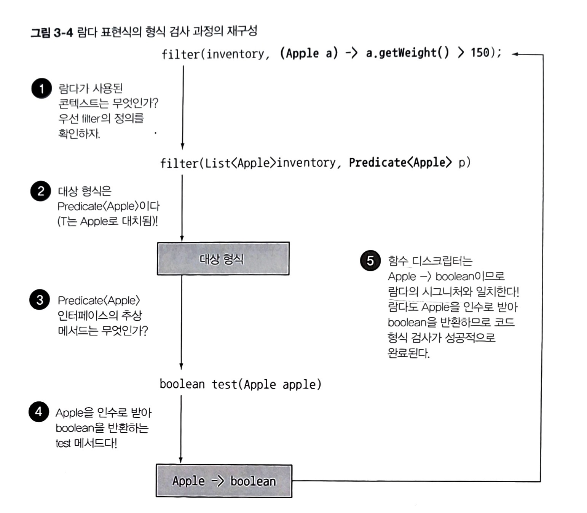
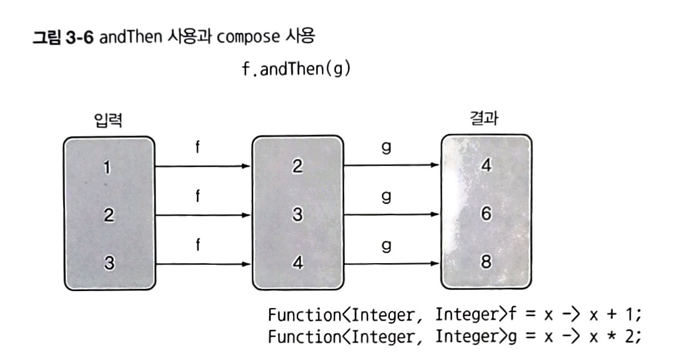
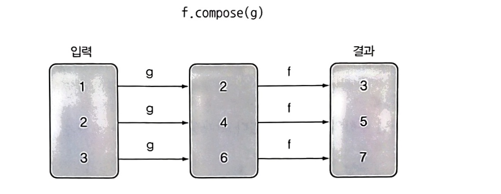

# 3.1 람다란 무엇인가?
> **람다 표현식** : 메서드로 전달할 수 있는 익명 함수를 단순화한 것

## 특징
1. **익명**
    - 이름이 없는 메서드
1. **함수**
    - 특정 클래스에 종속되지 않음
    - 하지만, 파라미터 리스트, 바디, 반환 형식, 가능한 예외 리스트를 포함
1. **전달**
    - 람다 표현식을 메서드 인수로 전달하거나 변수로 저장
1. **간결성**
    - 익명 클래스와 달리 자질구레한 코드 구현할 필요 없음
## 장점
1. 동작 파라미터 형식의 코드를 더 쉽게 구현
1. 코드가 간결하고 유연해짐


## 예시
```java
Comparator<Apple> byWeight = new Comparator<Apple>() {
    public int compare(Apple a1, Apple a2) {
        return a1.getWeight().compareTo(a2.getWeight());
    }
}
```

⬇️

```java
//람다 표현식
Comparator<Apple> byWeight = 
    (Apple a1, Apple a2) -> a1.getWeight().compareTo(a2.getWeight());
```

## 구성
```java
(Apple a1, Apple a2) -> a1.getWeight().compareTo(a2.getWeight());
```
1. 람다 파라미터 
    - `(Apple a1, Apple a2)` 
    - Comparator의 compare 메서드 파라미터
1. 화살표 
    - `->`  
    - 파라미터 리스트와 바디를 구분
1. 람다 바디 
    - `a1.getWeight().compareTo(a2.getWeight()); `
    - 반환값에 해당하는 표현식

## 스타일
1. **표현식** 스타일 (기본 문법)
    ```java
    (parameters) -> expression
    ```
1. **블록** 스타일
    ```java
    (parameters) -> { statements; }
    ```

## 유효한 람다 표현식 예제
```java
(String s) = s.length() 
//String 형식의 파라미터, int 반환
//람다 표현식에는 return이 함축되어 있음

(Apple a) -> a.getWeight() > 150
//Apple 형식의 파라미터, boolean 반환

(int x, int y) -> {
    System.out.println("Result:");
    System.out.println(x + y);
}
//int 형식의 파라미터 두 개, 리턴값 없음(void 리턴) 
//여러 개의 문장 포함 가능

() -> 42
//파라미터 없음, int 42 반환

(Apple a1, Apple a2) -> a1.getWeight().compareTo(a2.getWeight())
//Apple 형식의 파라미터 두 개, int 반환
```

<br/><br/>

# 3.2 어디에, 어떻게 람다를 사용할까?

람다는 함수형 인터페이스라는 문맥에서 사용할 수 있다.

## 3.2.1 함수형 인터페이스
> **함수형 인터페이스** : 정확히 **하나의 추상 메서드**를 지정하는 인터페이스
>
> ⚠️디폴트 메서드가 많더라도 추상 메서드가 오직 하나면 함수형 인터페이스다.

### 예시
```java
public interface Comparator<T> {
    int compare(T o1, T o2);
}

pubic interface Runnable {
    void run();
}
```

### 람다 활용법
전체 표현식을 **함수형 인터페이스의 인스턴스**로 취급할 수 있다.

<br/>

## 3.2.2 함수 디스크립터
> **함수 디스트립터** : 람다 표현식의 시그니처를 서술하는 메서드

<br/>

### 예시
- `(Apple, Apple) -> int` : Apple 형식의 파라미터 두 개, int 반환
- `() -> void` : 파라미터 없음, void 반환
- 등등

| 함수형 인터페이스 | 함수 디스크립터 | 기본형 특화 |
| --- | --- | --- |
| Predicate\<T> | T → boolean | IntPredicate, LongPredicate, DoublePredicate |
| Consumer\<T> | T → void  | IntConsumer, LongConsumer, DoubleConsumer |
| Function<T, R> | T → R | IntFunction\<R>, IntToDoubleFunction, IntToLongFunction, LongFunction\<R>, LongToDoubleFunction, LongToIntFunction, DoubleFunction\<R>, DoubleToIntFunction, DoubleToLongFunction, ToIntFunction\<T>, ToDoubleFunction\<T>, ToLongFunction\<T> |
| Supplier\<T> | () → T | BooleanSupplier, IntSupplier, LongSupplier, DoubleSupplier |
| UnaryOperator\<T> | T → T | IntUnaryOperator, LongUnaryOperator, DoubleUnaryOperator |
| BinaryOperator\<T> | (T, T) → T | IntBinaryOperator, LongBinaryOperator, DoubleBinaryOperator |
| BiPredicate<L, R> | (T, U) → boolean |  |
| BiConsumer<T, U> | (T, U) → void | ObjIntConsumer\<T>, ObjLongConsumer\<T>, ObjDoubleConsumer\<T> |
| BiFunction<T, U, R> | (T, U) → R | ToIntBiFunction<T, U>, ToLongBiFunction<T, U>, ToDoubleBiFunction<T, U> |

> **기본형 특화** : 기본형을 입출력으로 사용하는 상황에서 오토박싱을 피할 수 있도록 한 함수형 인터페이스
>
> - 제네릭 파라미터는 참조형만 사용할 수 있다.
> - 기본형 -> 참조형으로 변환하는 "박싱"을 자동으로 해주는 "**오토박싱**"을 하게 되면, 메모리를 더 소비하고, 기본형을 가져올 때도 메모리를 탐색하는 과정이 필요하다.
> - 그걸 피하기 위해 기본형 특화 인터페이스가 있음.


<br/>

<div class="callout" 
    style="
      display: flex;
      align-items: center;
      padding: 16px;
      background-color: #fef3c7; /* Light yellow background */
      border-radius: 8px;
      box-shadow: 0 2px 4px rgba(0, 0, 0, 0.1);
      margin-bottom: 16px;">
  <div class="icon"
    style="
    flex-shrink: 0;
      width: 40px;
      height: 40px;
      display: flex;
      align-items: center;
      justify-content: center;
      font-size: 24px;
      margin-right: 12px;
      background-color: #fef08a; /* Slightly darker yellow */
      border-radius: 50%;
    ">💡</div>
  <div class="content"
    style="
    flex-grow: 1;
      font-size: 13px;
      color: #374151; /* Dark gray text */
    ">
    <strong>@FunctionalInterface</strong> <br/>
    함수형 인터페이스임을 가리키는 어노테이션. 실제로 함수형 인터페이스가 아니면 컴파일 에러를 발생시킨다. 예를 들어 추상 메서드가 한 개 이상이라면 에러 발생.
  </div>
</div>

<br/><br/>

# 3.3 람다 활용 : 실행 어라운드 패턴
> **실행 어라운드 패턴** 
> 1. 초기화/준비 코드 (ex.자원 열기)
> 1. **작업**
> 1. 정리/마무리 코드 (ex.자원 닫기)


# 3.5 형식 검사, 형식 추론, 제약

## 3.5.1 형식 검사
람다가 사용되는 컨텍스트를 이용해 람다의 형식을 추론할 수 있다.
> **대상 형식** : 어떤 컨텍스트에서 기대되는 람다 표현의 형식

### 형식 확인 과정 예시
```java
List<Apple> heavierThan150g = filter(inventory, 
    (Apple apple) -> apple.getWeight() > 150);
```
1. filter 메서드의 선언을 확인
1. filter 메서드는 두 번째 파라미터로 **Predicate<Apple> 형식**(대상 형식)을 기대
1. Predicate<Apple>은 **test**라는 **한 개의 추상 메서드**를 정의하는 **함수형 인터페이스**다.
1. test 메서드는 **Apple을 받아 boolean을 반환**하는 함수 디스크립터를 묘사
1. filter 메서드로 전달된 인수는 이와 같은 요구사항을 만족해야 함

</img>


## 3.5.3 형식 추론
- **형식 추론**은 **할당문 컨텍스트**, **메서드 호출 콘텍스트**(파라미터, 반환값), **형변환 컨텍스트** 등으로 할 수 있다.
- 자바 컴파일러는 람다 표현식이 사용된 컨텍스트(대상 형식)를 이용해서 람다 표현식과 관련된 함수형 인터페이스를 추론한다.
- 즉, 대상 형식 -> 함수 디스크립터 알아냄 -> 람다의 시그니처 추론

### 예시
```java
Comparator<Apple> c = (Apple a1, Apple a2) -> a1.getWeight().compareTo(a2.getWeight());
//형식을 추론하지 않음

Comparator<Apple> c = (a1,  a2) -> a1.getWeight().compareTo(a2.getWeight());
//형식을 추론함
```
- 상황에 따라 명시적으로 형식을 포함하는 것이 좋을 때도 있고, 형식을 배제하는 것이 가독성을 향상시킬 때도 있다.


## 3.5.4 지역 변수 사용
> **자유 변수** : 파라미터로 넘겨진 변수가 아닌 **외부**에서 정의된 변수

> **람다 캡처링** : 익명함수가 하는 것처럼 자유 변수를 활용하는 것

### 주의사항
- 람다는 인스턴스 변수와 정적 변수를 자유롭게 캡처(자신의 바디에서 참조)할 수 있다.
- 그러려면 **지역 변수**는 **final** 선언이 되어있어야 하거나, 실질적으로 값이 변하지 않는 final 변수처럼 사용되어야 한다.
    - why?
        - 인스턴스 변수는 힙에 저장, 지역변수는 스택에 위치
        - 람다에서 지역 변수에 바로 접근할 수 있는 가정 하에, 람다가 스레드에서 실행된다면 변수를 할당한 스레드가 사라져서 변수 할당이 해제되었는데도 람다를 실행하는 스레드에서는 해당 변수에 접근하려 할 수 있다.
        - 이를 방지하기 위해 원래 변수에 접근X, 자유 지역 변수의 **복사본**을 제공.
        - 복사본의 값이 바뀌지 않아야 하므로 지역 변수에는 한 번만 값을 할당해야 한다. == `final`

### 예시
```java
// 가능 코드
int portNumber = 1337;
Runnable r = () -> System.out.println(portNumber);
```
```java
// 불가능 코드
int portNumber = 1337;
Runnable r = () -> System.out.println(portNumber);
portNumber = 31337;
```


<br/><br/>

# 3.6 메서드 참조
```java
inventory.sort((Apple a1, Apple a2) -> a1.getWeight().compareTo(a2.getWeight()));
```
⬇️

```java
// 메서드 참조
inventory.sort(comparing(Apple::getWeight));
```

## 3.6.1 람다 표현식 -> 메서드 참조
1. 정적 메서드 참조
    ```java
    //람다
    (args) -> Classname.staticMethod(args)

    //메서드 참조
    ClassName::staticMethod
    ```
    ```java
    //람다
    ToIntFunction<String> stringToInt = (String s) -> Integer.parseInt(s);

    //메서드 참조
    Function<String, Integer> stringToInteger = Integer::parseInt;
    ```
1. 다양한 형식의 인스턴스 메서드 참조
    ```java
    //람다
    (arg0, rest) -> arg0.instanceMethod(rest)

    //메서드 참조
    ClassName::instanceMethod
    ```
    ```java
    //람다
    BiPredicate<List<String>, String> contains = (list, element) -> list.contains(element)

    //메서드 참조
    BiPredicate<List<String>, String> contains = List::contains;
    ```

1. 기존 객체의 인스턴스 메서드 참조
    ```java
    //람다
    (args) -> expr.instanceMethod(args)


    //메서드 참조
    expr::instanceMethod
    ```
    ```java
    //람다
    Predicate<String> startsWithNumber = (String string) -> this.startsWithNumber(string);

    //메서드 참조
    Predicate<String> startsWithNumber = this::startsWithNumber;
    ```

## 3.6.2 생성자 참조
- 정적 메서드의 참조를 만드는 방법과 비슷

### 예시
```java
Supplier<Apple> c1 = Apple::new;
Apple a1 = c1.get(); //Supplier의 get 메서드를 호출해 새로운 Apple 객체를 만들 수 있다.
```
```java
//파라미터가 1개 있는 생성자
Function<Integer, Apple> c2 = Apple::new;
Apple a2 = c2.apply(110); //Function의 apply 메서드에 무게를 인수로 호출해 새로운 Apple 객체를 만들 수 있다.
```
```java
//파라미터가 2개 있는 생성자
BiFunction<Color, Integer, Apple> c3 = Apple::new;
Apple a3 = c3.apply(GREEN, 110); //BiFunction의 apply 메서드에 색과 무게를 인수로 제공공해 새로운 Apple 객체를 만들 수 있다.
```

<br/><br/>

# 3.8 람다 표현식을 조합할 수 있는 유용한 메서드
- Comparator, Function, Predicate 같은 함수형 인터페이스는 람다 표현식을 **조합**할 수 있도록 **유틸리티 메서드**를 제공
- 즉, 여러 개의 람다 표현식을 조합 -> 복잡한 람다 표현식
- **디폴트 메서드**가 있기 때문에 함수형 인터페이스에서도 정의에 어긋나지 않게 추가 메서드를 제공할 수 있다.

## 3.8.1 Comparator 조합
1. `.reversed()`
    - 역정렬
1. `.thenComparing(함수)`
    - 함수를 인수로 받아 첫 번쨰 비교자를 이용해서 두 객체가 같다고 판단되면 두 번째 비교자에 객체를 전달

    ```java
    inventory.sort(comparing(Apple::getWeight))
            .reversed() //무게를 내림차순으로 정렬
            .thenComparing(Apple::getCountry) //두 사과의 무게가 같으면 국가별로 정렬
    ```

## 3.8.2 Predicate 조합
1. `.negate()`
    - '빨간색이 **아닌** 사과'처럼 특정 Predicate를 반전시킬 때
    ```java
    Predicate<Apple> notRedApple = redApple.negate();
    //기존 Predicate 객체 redApple의 결과를 반전시킨 객체를 만든다.
    ```
1. `.and()`
    - '빨간색이**면서** 무거운 사과'
1. `.or()`
    - '빨간색이면서 무거운 사과 **또는** 그냥 녹색 사과'
    - **주의사항**
        - `a.or(b).and(c)` 는 `(a || b) && c`

## 3.8.3 Function 조합
1. `andThen`
    - 주어진 함수를 먼저 적용한 결과를 다른 함수의 입력으로 전달
    ```java
    Function<Integer, Integer> f = x -> x + 1;
    Function<Integer, Integer> g = x -> x * 2;
    Function<Integer, Integer> h = f.andThen(g); //g(f(x))
    
    int result = h.apply(1); //4
    ```
    </img>
1. `compose`
    - 인수로 주어진 함수를 먼저 실행-> 그 결과를 외부 함수의 인수로 제공
    ```java
    Function<Integer, Integer> f = x -> x + 1;
    Function<Integer, Integer> g = x -> x * 2;
    Function<Integer, Integer> h = f.compose(g); //f(g(x))
    
    int result = h.apply(1); //3
    ```
    </img>