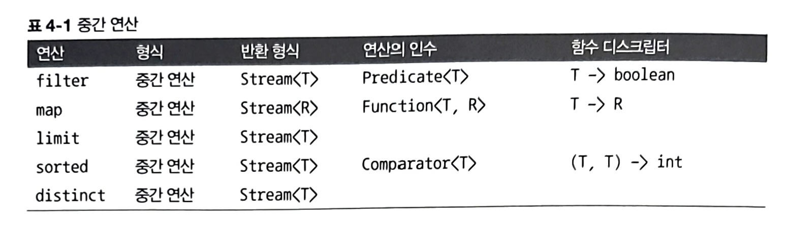

# 4.1 스트림이란 무엇인가?
> **스트림** : 데이터 처리 연산을 지원하도록 소스에서 추출된 연속된 요소
- **연속된 요소**
    - 컬렉션과 마찬가지로 연속된 값 집합의 인터페이스
    - 컬렉션은 데이터, 자료구조, 시간/공간의 복잡성, 관련된 요소 저장, 접근 연산
    - 스트림은 표현계산식
- **소스**
    - 컬렉션, 배열, I/O 자원 등의 데이터 제공 소스로부터 데이터를 소비한다.
    - 제공 소스와 같은 순서를 유지
- **데이터 처리 연산**
    - 데이터베이스와 비슷한 연산 지원
    - 순차 실행, 병렬 실행 가능

## 스트림의 특징
1. **파이프라이닝**
    - 연산끼리 연결
    - 그 덕에 laziness, short-circuiting같은 최적화을 얻을 수 있음.
1. **내부 반복**
    - 데이터 표현과 하드웨어를 활용한 병렬성 구현을 자동으로 선택
1. 단 한 번만 소비
    - 한 번만 탐색할 수 있고, 탐색된 스트림의 요소는 소비된다.

## 스트림 API의 특징
1. **선언형** : 더 간결하고 가독성이 좋아진다.
1. **조립할 수 있음** : 유연성이 좋아진다.
1. **병렬화** : 성능이 좋아진다.

## 컬렉션과 스트림
| 컬렉션 | 스트림 |
| --- | --- |
| DVD | 스트리밍 |
| 모든 요소는 컬렉션에 추가하기 전에 계산 | 요청할 때만 요소를 계산 |
| 생산자 중심 | 생산자와 소비자 관계 |
| 적극적 생성 | 게으른 생성 |
| 외부 반복 | 내부 반복 |

## 스트림 연산
1. 중간 연산
    - 연결할 수 있는 스트림 연산
    - 다른 스트림을 반환
    - 최종 연산을 실행하기 전까지는 **아무 연산도 수행하지 않는다**. (lazy)
    </img>
1. 최종 연산
    - 스트림을 닫는 연산
    - 주로 List, Integer, void 등 스트림 이외의 결과가 반환됨
    </img>